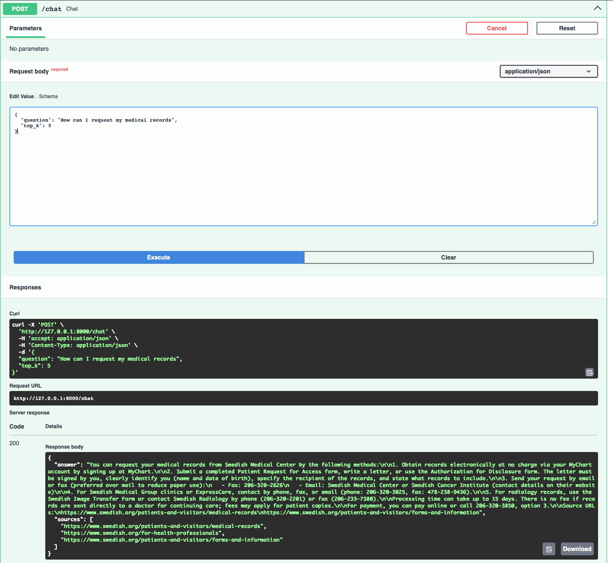
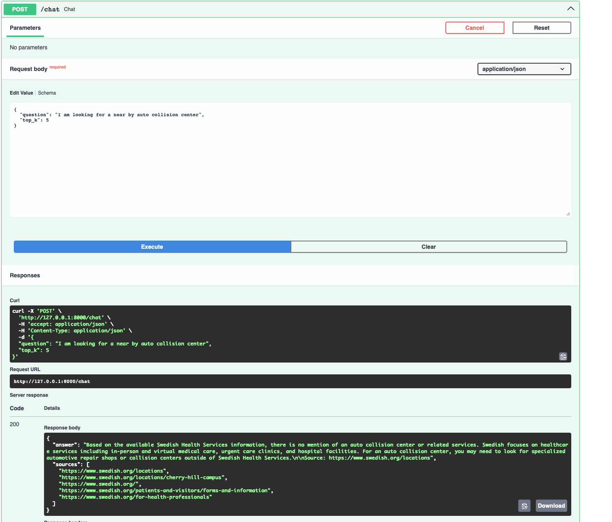

# Swedish Public Info RAG Assistant

A complete educational RAG project that answers questions using public Swedish Health Services web pages.

This is **not** a medical diagnosis or treatment system. It is a patient-information assistant demo for hospital public information such as locations, visitor information, virtual care, forms, and medical records.

## What it does

1. Reads public Swedish web pages from `data/seed_urls/swedish_urls.txt`
2. Scrapes and cleans page text
3. Splits text into chunks
4. Creates embeddings with OpenAI
5. Stores vectors in ChromaDB
6. Retrieves relevant chunks for a user question
7. Sends retrieved context to an LLM
8. Returns a grounded answer with source URLs

## Architecture

```text
Swedish public pages
        ↓
Scraper
        ↓
Chunking
        ↓
OpenAI embeddings
        ↓
Chroma vector DB
        ↓
FastAPI /chat endpoint
        ↓
LLM answer with sources
```

## Project structure

```text
swedish-rag-assistant/
  app/
    __init__.py
    main.py          # FastAPI app
    config.py        # Environment settings
    scraper.py       # Swedish page scraping and cleaning
    chunking.py      # Token-based chunking
    vector_store.py  # Chroma + OpenAI embeddings
    ingest.py        # Ingestion command
    rag_service.py   # Retrieval + LLM answer generation
  data/
    seed_urls/
      swedish_urls.txt
  requirements.txt
  .env.example
  README.md
```

## Setup

```bash
cd swedish-rag-assistant
python3 -m venv venv
source venv/bin/activate
pip install -r requirements.txt
cp .env.example .env
```

Edit `.env` and add your OpenAI API key:

```bash
OPENAI_API_KEY=your_openai_api_key_here
```

## Ingest documents

```bash
python -m app.ingest --urls-file data/seed_urls/swedish_urls.txt
```

This creates a local Chroma database in `./chroma_db`.

## Run API

```bash
uvicorn app.main:app --reload
```

Open:

```text
http://127.0.0.1:8000/docs
```

## Test with curl

```bash
curl -X POST http://127.0.0.1:8000/chat \
  -H "Content-Type: application/json" \
  -d '{"question":"How can I request my medical records?","top_k":5}'
```

## Example questions

```text
How can I request my medical records?
Where is Swedish Cherry Hill Campus?
What can virtual care help with?
What information is available for patients and visitors?
```

## Demo Screenshot




## Important healthcare safety guardrails

The system prompt requires the assistant to:

- Answer only from retrieved context
- Avoid diagnosis and treatment advice
- Tell users with urgent symptoms to call 911 or contact a clinician
- Say it does not know when the answer is not in the retrieved Swedish public information

## Notes for a real production healthcare RAG system

For production, add:

- HIPAA review and legal/privacy approval
- Access control by user role and patient relationship
- Audit logging
- Source document versioning
- Human-reviewed medical content
- Better crawler governance and robots.txt handling
- PHI redaction if internal documents are indexed
- Evaluation tests for hallucination, source faithfulness, and safety
- Clear disclaimer that it is not medical advice
